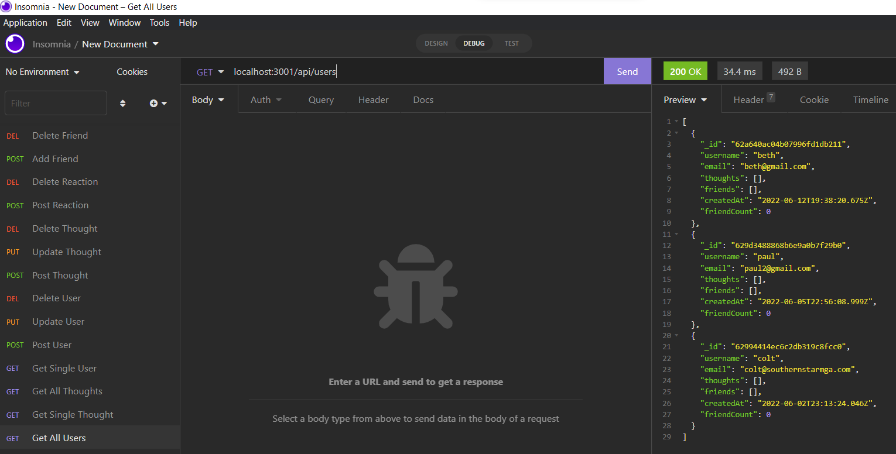

# **THINK OUTLOUD**

## Description:

Backend api for a social media site that allows suers to post thoughts and react to other users thoughts. Users may also maintain a friends list of other users.

## Screenshot:

## Links:

- [Link to Github Repo](https://github.com/coltschultz/think-outloud)
- [Link to Demo Video](https://streamable.com/a66qa7)
